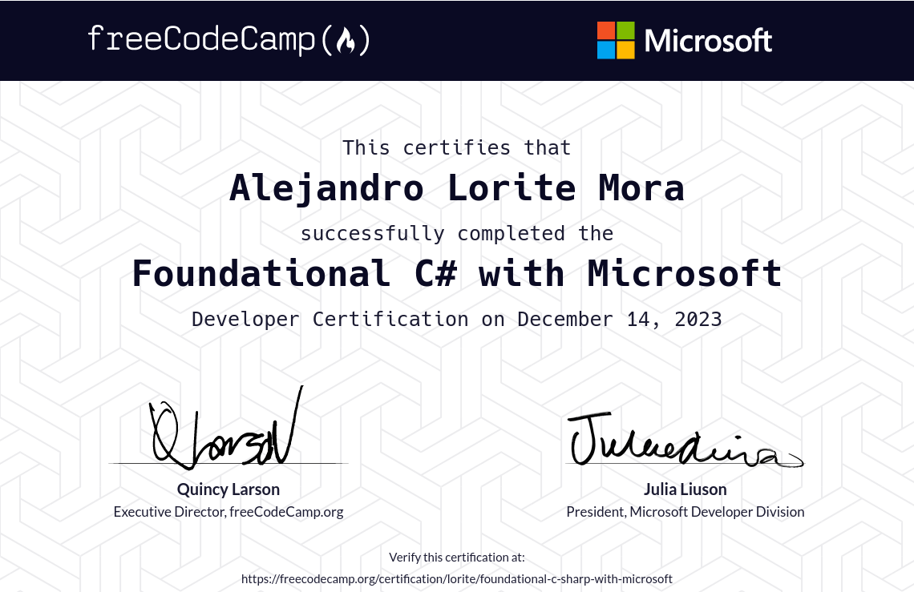

# Notes

Although it would be better to use slightly more advanced aspects of C#, especially in the first few lessons, I follow the course as closely as possible and do not use anything not yet introduced.

In the first part, for instance, things like classes, methods, loops, etc are not introduced, so I decide not to use them at all. For example, for the projects at the end of the parts, it would be much better to create tests and run functions against them.

Most of the files are compiled as binaries that then print stuff on the console. Read the comments in the code for explanations.

Sadly I had still not configured my VS Code to lint and format my code, so the code is not as clean as it should be. I am building the code using bazel instead of dotnet or msbuild, and I couldn't find a way to configure the linter to work with bazel.

# How to run the code

To build all the files in the course, run the following in the root directory of the course:

```bash
bazel build //...
```

To run a specific file, run the following in the root directory of the course:

```bash
bazel run //:target
```

where `target` is the name of the file without the extension. For example, p1_m02_literal_data_types_bin.
You can find all available targets in the BUILD file in the root directory of the course. Also using tab completion in the command line should work. And also using bazel query.

```bash
bazel query //:*
```

# Outcomes of the course

The course provides a good introduction to programming and C# in particular. It is way too long and simple for someone who already knows how to program, but it is a good introduction for someone who has never programmed before. For learning new languages, next time, I will probably use the official documentation of the language instead of a course like this one. Cheatsheets would also be good and I'll start populating them at [/cheatsheets](/cheatsheets/README.md) I will probably use a course like this one for learning new complex frameworks or libraries.

## Certificate

[freeCodeCamp - Foundational C# with Microsoft](https://www.freecodecamp.org/certification/lorite/foundational-c-sharp-with-microsoft) 

# Sources:

- [Microsoft Learn Training | Get started with C# Part 1 | Write Your First Code Using C#](https://learn.microsoft.com/en-us/training/paths/get-started-c-sharp-part-1/)
- [Microsoft Learn Training | Get started with C# Part 2 | Create and run simple C# console applications](https://learn.microsoft.com/en-us/training/paths/get-started-c-sharp-part-2/)
- [Microsoft Learn Training | Get started with C# Part 3 | Add logic to C# console applications](https://learn.microsoft.com/en-us/training/paths/get-started-c-sharp-part-3/)
- [Microsoft Learn Training | Get started with C# Part 4 | Work with variable data in C# console applications](https://learn.microsoft.com/en-us/training/paths/get-started-c-sharp-part-4/)
- [Microsoft Learn Training | Get started with C# Part 5 | Create methods in C# console applications](https://learn.microsoft.com/en-us/training/paths/get-started-c-sharp-part-5/)
- [Microsoft Learn Training | Get started with C# Part 6 | Debug C# console applications](https://learn.microsoft.com/en-us/training/paths/get-started-c-sharp-part-6/)

This project is linked to the following freeCodeCamp course: [(New) Foundational C# with Microsoft](https://www.freecodecamp.org/learn/foundational-c-sharp-with-microsoft/)
